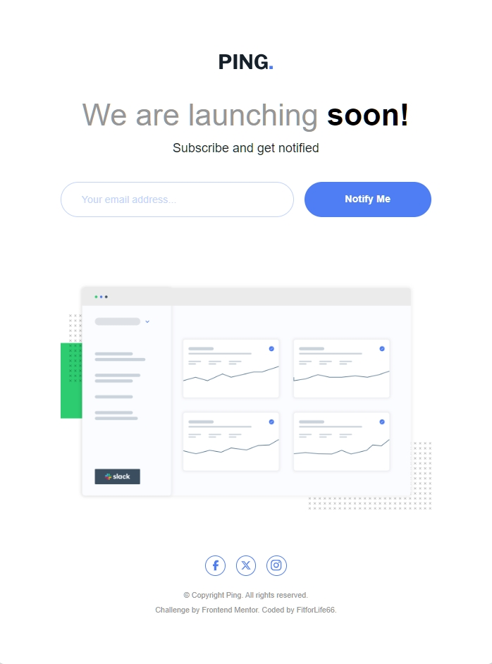

# Frontend Mentor - Ping coming soon page solution

This is a solution to the [Ping coming soon page challenge on Frontend Mentor](https://www.frontendmentor.io/challenges/ping-single-column-coming-soon-page-5cadd051fec04111f7b848da). The goal of this project was to build a clean, responsive landing page with basic form validation using modern React tooling.

## Table of contents

- [Overview](#overview)
  - [The challenge](#the-challenge)
  - [Screenshot](#screenshot)
  - [Links](#links)
- [My process](#my-process)
  - [Built with](#built-with)
  - [What I learned](#what-i-learned)
  - [Continued development](#continued-development)
- [Author](#author)

## Overview

### The challenge

Users should be able to:

- View the optimal layout for the site depending on their device's screen size
- See hover states for all interactive elements on the page
- Submit their email address using an input field
- Receive an error message when the form is submitted if the email address is invalid

### Screenshot

### Links

- Solution URL: https://www.frontendmentor.io/solutions/ping-coming-soon-page/
- Live Site URL: https://f4l-ping-coming-soon-page.netlify.app/

## My process

### Built with

- Semantic HTML5
- Tailwind CSS
- Mobile-first workflow
- React
- Vite
- TypeScript

### What I learned

During this project I reinforced two important concepts:

1. **Callback functions vs. events**  
   Callback functions themselves run synchronously. The asynchronous behavior comes from the event system (e.g. form submission, input events), not from the callbacks.

2. **SVG handling in React**  
   I learned different ways to work with SVGs in React:
   - Using SVGs from the `public` folder
   - Importing SVGs as components for better styling and reuse
   - Passing class names to SVG components for consistent styling with Tailwind CSS

These concepts helped me better understand React's rendering and event model, as well as asset handling in modern frontend setups.

## Author

- Frontend Mentor – FitforLife66

